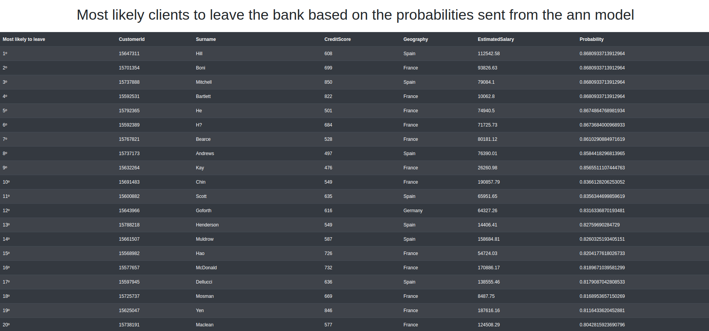

# Ordenação das probabilidades dos clientes deixarem determinado banco

## Aluno  
| Matrícula | Nome |  
|-----------------------|---------------------|  
| 17/0033112 | Eugênio Sales Siqueira |  
  
## Descrição do projeto

* Tipo do problema: Probabilidade

* Um banco quer investigar o motivo da perda de alguns clientes, para isso separou um dataset com 10000 mil amostras dos últimos 6 meses com clientes que deixaram e que ainda permanecem no banco 

* Missão: Com a saída de uma ann com uma função logística no último layer, será retornado a probabilidade dos clientes atuais deixarem o banco e com isso, estará presente uma tabela uma lista com os clientes remanescentes mais propensos a deixarem o banco

## Guia de instalação
### Execute com virtualenv
* Crie um arquivo virtualenv `virtualenv -p python3 env`
* Ative com `source env/bin/activate`
* Instale os requirimentos `pip install -r requirements.txt`
* Execute o servidor com `python3 app.py`
* Acesse `localhost:5000` no browser

### Execute com Docker
* Baixe o docker-compose: `sudo apt install docker-compose`
* Execute `sudo docker-compose up --build`
* Acesse `localhost:5000` no browser

## Capturas de tela
 

## Conclusões
O quick sort é um algoritmo eficiente tendo em vista a quantidade de dados a serem ordenados.

## Referências
* <a href="https://pt.wikipedia.org/wiki/Quicksort"> Quick Sort Wiki</a>
